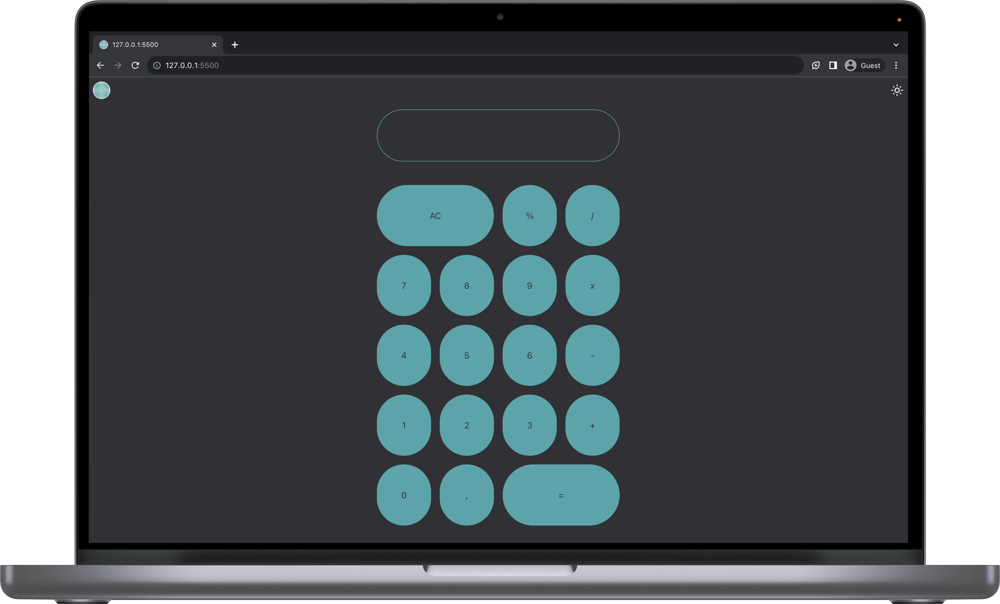
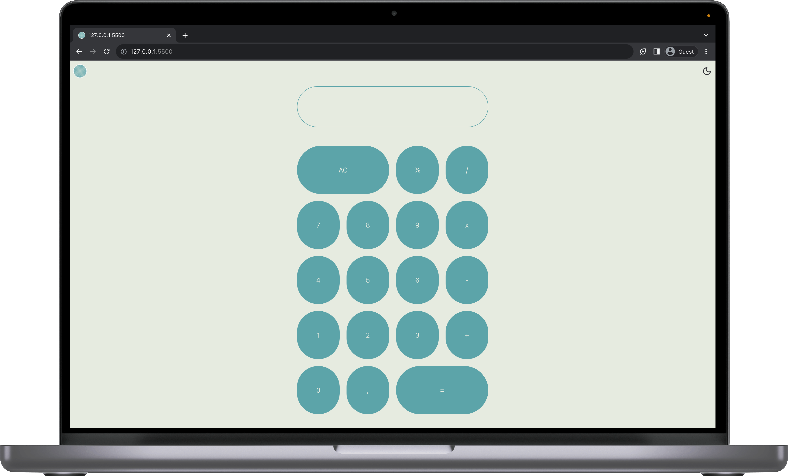

# Calculator App 🧮
A simple calculator web app built with Alpine.js, Tailwind CSS, and Material Icons.

## Project Overview
This project is part of a 30-day coding challenge, where we progressively build more complex applications.

On Day 1, we start with a basic calculator app. It allows users to perform basic arithmetic operations like addition, subtraction, multiplication, and division.




## Features
Perform addition, subtraction, multiplication, and division.

Clear button to reset the calculation.
Memory function to see calculation history.

Dark mode to switch between light and dark themes.

## Getting Started
To run this project locally, follow these steps:

Clone this repository to your local machine.
```bash
git clone
```

Navigate to the project directory.
```bash
cd Day_01_Calculator
```

Open the terminal and use a development server like [serve](https://github.com/vercel/serve#readme) to run the project:

```bash
serve
```
Open your web browser and access the app at http://localhost:3000 (or the appropriate port indicated by your development server).

## Technologies Used
[Alpine.js](https://alpinejs.dev/): A minimal framework for composing JavaScript behavior in your HTML.

[Tailwind CSS](https://tailwindcss.com/): A utility-first CSS framework for rapid UI development.

[Material Icons](https://fonts.google.com/icons): A collection of Google's Material Design icons.

## Author
Romain Neuplanche

## License
This project is open-source and available under the MIT License.

*Happy calculating! 🚀🧮*